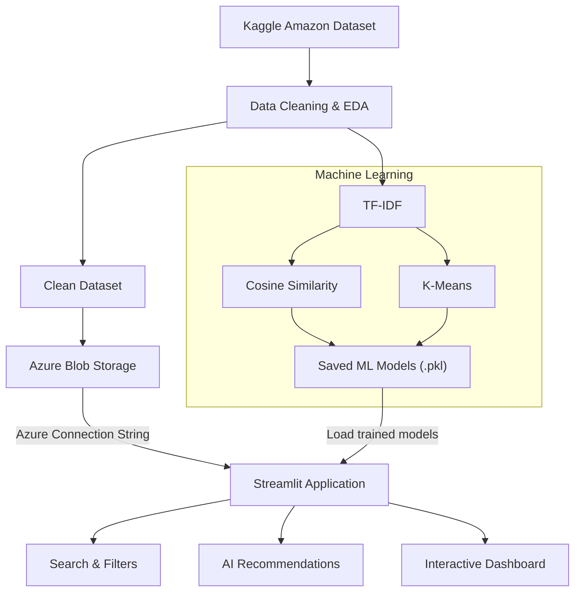

# Amazon Product Intelligence — Architecture

## Overview

Amazon Product Intelligence is an end-to-end data and machine learning application that combines **data processing, cloud storage, machine learning, and an interactive Streamlit dashboard**.

The project uses a historical Amazon product dataset from Kaggle. The data is cleaned, analyzed, stored in **Azure Blob Storage**, and connected to a recommendation system built using **TF-IDF, Cosine Similarity, and K-Means**.

---

## System Architecture



---

## Data Pipeline

```text
Kaggle Dataset
      ↓
Data Cleaning
      ↓
EDA
      ↓
Clean Dataset ─────────→ Azure Blob Storage
      ↓
ML Training
      ↓
Saved Models
      ↓
Streamlit Application
```

The cleaned dataset is stored in the Azure Blob Storage container:

```text
amazon-data/
└── amazon_clean.csv
```

The application retrieves the dataset from Azure using a secure **Azure Storage Connection String** stored through Streamlit secrets.

---

## Machine Learning

The recommendation system uses:

* **TF-IDF** — converts product text into numerical features.
* **Cosine Similarity** — measures similarity between products.
* **K-Means** — groups products with similar characteristics.

Trained components are saved and reused as `.pkl` files:

```text
models/
├── kmeans_model.pkl
├── scaler.pkl
├── tfidf_vectorizer.pkl
├── cosine_similarity.pkl
└── recommendation_data.pkl
```

### Recommendation Flow

```text
User Search / Filters
        ↓
Matching Products
        ↓
Existing Similarity Model
        ↓
Similarity + Rating Ranking
        ↓
Top AI Recommendations
```

The recommendation system displays up to **5 relevant products** from the user's current filtered results.

---

## Cloud Integration

**Azure Blob Storage** is used as the cloud data layer.

```text
Streamlit
    │
    │ Azure Connection String
    ▼
Azure Blob Storage
    │
    ▼
amazon_clean.csv
```

The Azure credentials are kept outside the source code using:

```text
.streamlit/secrets.toml
```

This file should never be committed to GitHub.

---

## Application Layer

The Streamlit dashboard provides:

* Product search
* Category hierarchy filtering
* Price filtering
* Rating filtering
* Product results
* AI-powered recommendations
* Direct Amazon product links

The application loads the **existing trained models** rather than retraining them every time it runs.

Because the project uses a historical/static dataset, the models can be trained once and reused. If the dataset is updated in the future, the ML pipeline can be executed again to generate new models.

---

## Technology Stack

| Layer             | Technology         |
| ----------------- | ------------------ |
| Data Source       | Kaggle             |
| Data Processing   | Pandas, NumPy      |
| Machine Learning  | Scikit-learn       |
| NLP               | TF-IDF             |
| Similarity        | Cosine Similarity  |
| Clustering        | K-Means            |
| Cloud Storage     | Azure Blob Storage |
| Application       | Streamlit          |
| Model Persistence | Joblib             |
| Documentation     | GitHub + Mermaid   |

---

## Project Structure

```text
AmazonProductIntelligence/
│
├── app.py
├── README.md
├── Architecture.md
├── requirements.txt
├── snapshots
│
├── models/
│   ├── kmeans_model.pkl
│   ├── scaler.pkl
│   ├── tfidf_vectorizer.pkl
│   ├── cosine_similarity.pkl
│   └── recommendation_data.pkl
│
└── .streamlit/
    └── secrets.toml
```

---

## Key Design Decision

The project separates **ML training** from **application runtime**.

Models are trained and saved beforehand, while the Streamlit application focuses on retrieving cloud data, loading the trained models, filtering products, and generating recommendations.

This keeps the application lightweight and avoids unnecessary model retraining for a static historical dataset.
